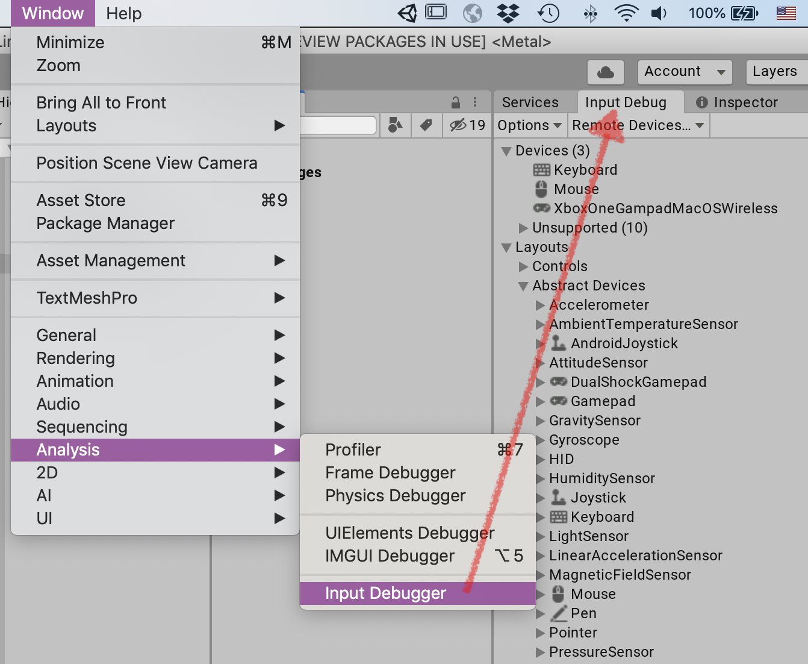
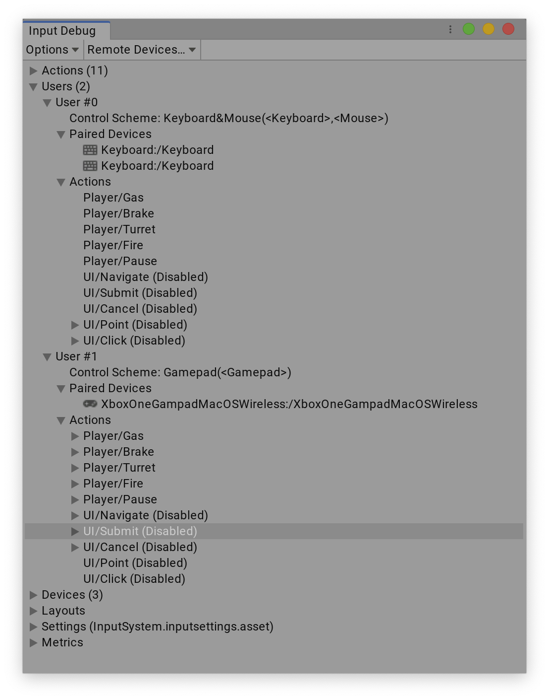

# Debugging

* [Input Debugger](#input-debugger)
  * [Debugging Devices](#debugging-devices)
  * [Debugging Actions](#debugging-actions)
  * [Debugging Users/PlayerInput](#debugging-usersplayerinput)
  * [Debugging Layouts](#debugging-layouts)
  * [Debugging Remotely](#debugging-remotely)

When something isn't working as expected, the best first stop is usually the "Input Debugger" in the Unity editor. This is a Unity editor window that is designed to provide access to the activity of the input system in both the editor and in connected players.

To open the input debugger, go to `Window >> Analysis >> Input Debugger` in Unity's main menu in the editor.

## Input Debugger

The debugger shows a tree breakdown of the state of the input system.

|Item|Description|
|----|-----------|
|Devices|[Input devices](Devices.md) that are currently added to the system as well as a list of unsupported/unrecognized devices.|
|Layouts|A breakdown of all registered control and device layouts. This is essentially the database of supported hardware and the knowledge of how to represent a given piece of input hardware.|
|Actions|Only visible in play mode and only if there are [actions](Actions.md) that are currently enabled.  Shows the list of all currently enabled actions and the controls they are bound to.  See [Debugging Actions](#debugging-actions).|
|Users|Only visible when there is one or more `InputUser` instances. See [documentation](UserManagement.md).  Lists all currently active uers along with their active control schemes and devices, all their associated actions as well as the controls they are bound to.  Note that `PlayerInput` uses `InputUser` underneath. This means that when using `PlayerInput` components, each player will have an entry here.  See [Debugging Users/PlayerInput](#debugging-usersplayerinput).|
|Settings|Shows the currently active Input System [settings](Settings.md).|
|Metrics|Shows some statics about Input System resource usage.|

### Debugging Devices

You can double-click on any [input device](Devices.md) in the `Devices` list in the debugger window to open a window showing information about the device, including real-time state information for its controls.

The top of the device window shows some general information about the specific device (such as name, manufacturer, serial number, etc).

Below that, you you see a view listing the devices controls, and their state. This is very useful when debugging input issues, as it allows you to verify if the data the input system is receiving from the input device is what you'd expect it to be in the first place. At the top of this view you will see the following buttons:

* `State`: Show the current state of the device in a new window. This is identical to the information as shown in this view, but is not updated, so you can take a slice of input state data and take the time to inspect it as needed.

* `HID Descriptor`: Only shown for devices connected using the HID protocol. This will open a window showing the detailed [HID](HID.md) specifications for the device and each of it's logical controls.

Finally, in the bottom of the window, you can inspect the event stream coming from the device. Any [Input Event](Events.md) generated by the device will be shown here. You can double-click any event in the list to inspect the full device state at the time of the event. You can also select multiple events, and right click and choose "Compare" in the context menu to get a side-by-side difference between the state of the device at two different points in time.

### Debugging Actions

Any enabled [actions](Actions.md) are listed in the Actions list in the debugger window (only shown if any actions are active and the editor is in play mode). If an action has actively bound controls, you can click the arrow next to the action to see them in the list. This is useful to debug whether your bindings correctly map to the controls you want them to bind to. See ["Binding Resolution"](ActionBindings.md#binding-resolution) for more info on how bindings are mapped to controls.

>NOTE: Actions belonging to [`InputUsers`](UserManagement.md) will not be shown here, but will be shown in the [Users](#debugging-usersplayerinput) list instead.

### Debugging Users/PlayerInput

When there are multiple [`InputUser`](UserManagement.md) instances &ndash; each `PlayerInput` will implicitly create one &ndash;, the debugger will list each user along with its paired devices and active actions. The listed devices and actions work the same way as those shown in the [devices](#debugging-devices) and [actions](#debugging-actions) lists in the debugging window.

### Debugging Layouts

The [`Layouts`](Layouts.md) list in the Debugger window shows a breakdown of all registered [control and device layouts](Layouts.md). This is essentially the database of supported hardware and the knowledge of how to represent a given piece of input hardware. This is mostly handy when you want to [create a new device mapping](HowDoI.md#-create-my-own-custom-devices), and want to see how it gets represented by the input system.

### Debugging Remotely

You can connect input debugger to a player running on a device. This makes input activity from the player observable in the editor. The mechanism used by this is Unity's `PlayerConnection`, i.e. the same mechanism by which the Unity profiler can be connected to a player.

>NOTE: At the moment, debugging input in players is restricted to seeing devices and events from connected players. There is no support yet for seeing other input-related data such as actions and input users from players.

To see remote devices from built players, click the `Remote Devices…` pop-up button in the Debugger window. You will see a list of remote player instance you can connect to (if there are any) - this is the same list as you will see in the Profiler and Console windows, and any connections are share between those windows. If any player(s) are connected, you can enable `Show remote devices` in the same popup button. If players are connected, and `Show remote devices` is enabled, the [`Devices`](#debugging-devices) list in the debugger window will be split into a `Local` section and a `Remote` section. The `Remote` section will show any input device from any connected player, and lets you inspect device state and events in real time, just as if it were a local device.

[//]: # (TODO: Mention ## Input Visualizers once we have decided on a location for our samples to link to)
