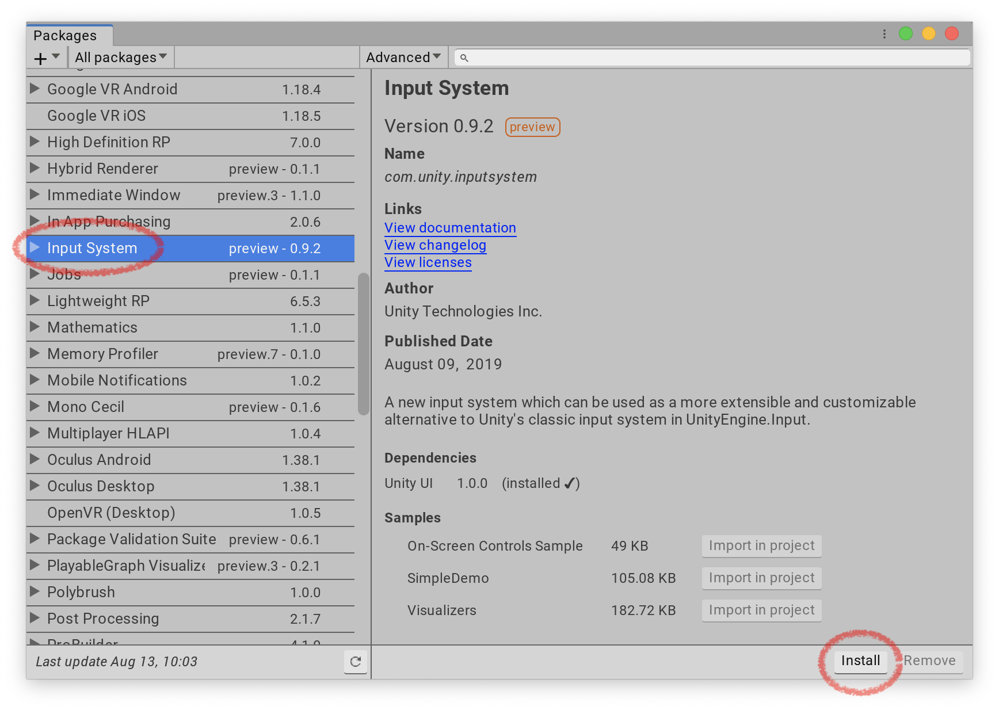
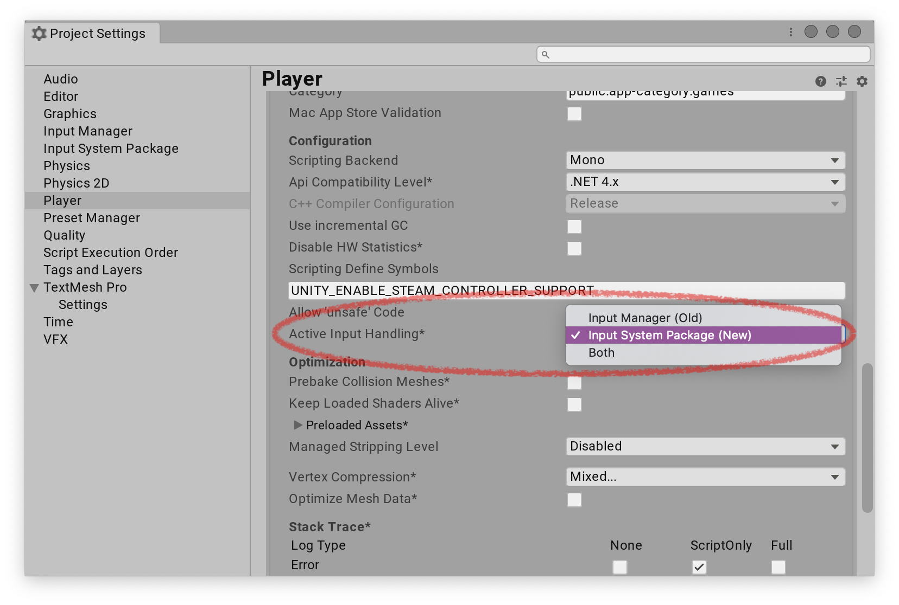

# Installation Guide

This is a short guide on how to install and activate the new input system in your Unity project.

>NOTE: The new input system requires Unity 2019.1+ and the .NET 4 runtime. It does not work in projects using the old .NET 3.5 runtime.

## Installing the Package

The new input system can be installed via Unity's package manager (`Window >> Package Manager`).

To see the input system package, make sure that "Show Preview Packages" is enabled as at this point the new input system is still under development.

From the list, select the latest "Input System" package and install it.

## Enabling the New Input Backends

By default, Unity's classic input system is active and support for the new input system is inactive. This is to allow existing Unity projects to continue to function as is.

To fully switch from the old input system to the new input system for a project, go into "Edit >> Project Settings... >> Player" and change "Active Input Handling" from "Input Manager" to "Input System (Preview)".

Note that for this setting to take effect, the Unity __editor must be restarted__.
