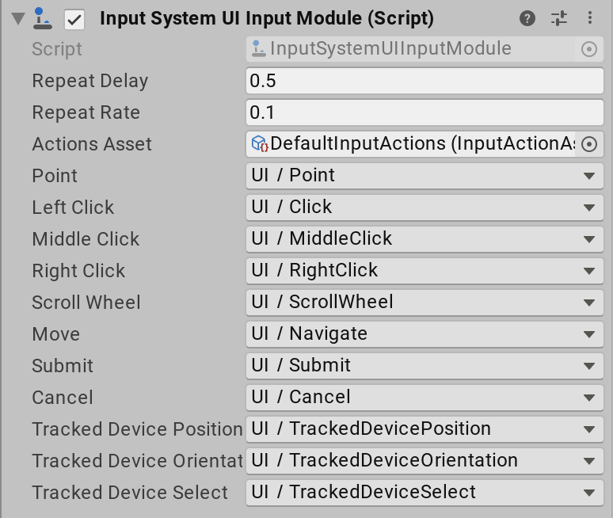

# UI Support

The Input System can be used to control any in-game UI created with the [Unity UI package](https://docs.unity3d.com/Manual/UISystem.html). The integration between the Input System and the UI system is handled by the [`InputSystemUIInputModule`](../api/UnityEngine.InputSystem.UI.InputSystemUIInputModule.html) component.

## `InputSystemUIInputModule` Component

The [`InputSystemUIInputModule`](../api/UnityEngine.InputSystem.UI.InputSystemUIInputModule.html) component acts as a drop-in replacement for the [`StandaloneInputModule`](https://docs.unity3d.com/Manual/script-StandaloneInputModule.html) component provided by the Unity UI package. [`InputSystemUIInputModule`](../api/UnityEngine.InputSystem.UI.InputSystemUIInputModule.html) provides the same kind of functionality as  [`StandaloneInputModule`](https://docs.unity3d.com/Manual/script-StandaloneInputModule.html), but it uses the Input System instead of the legacy Input Manager to drive UI input.

If you have a [`StandaloneInputModule`](https://docs.unity3d.com/Manual/script-StandaloneInputModule.html) component on a game object, and the Input System is installed, Unity will show a button in the inspector offering to automatically replace it with a [`InputSystemUIInputModule`](../api/UnityEngine.InputSystem.UI.InputSystemUIInputModule.html) for you. The [`InputSystemUIInputModule`](../api/UnityEngine.InputSystem.UI.InputSystemUIInputModule.html) is preconfigured to use default input actions to drive the UI, but you can override that configuration to suit your needs.

You can use the following properties to configure [`InputSystemUIInputModule`](../api/UnityEngine.InputSystem.UI.InputSystemUIInputModule.html):

|Property|Description|
|--------|-----------|
|[`Repeat Delay`](../api/UnityEngine.InputSystem.UI.InputSystemUIInputModule.html#UnityEngine_InputSystem_UI_InputSystemUIInputModule_repeatDelay)|The Initial delay (in seconds) between an initial move action and a repeated move action.|
|[`Repeat Rate`](../api/UnityEngine.InputSystem.UI.InputSystemUIInputModule.html#UnityEngine_InputSystem_UI_InputSystemUIInputModule_repeatDelay)|The speed (in seconds) that the move action repeats itself once repeating.|
|[`Actions Asset`](../api/UnityEngine.InputSystem.UI.InputSystemUIInputModule.html#UnityEngine_InputSystem_UI_InputSystemUIInputModule_actionsAsset)|An [`Input Action Asset``](ActionAssets.md) containing all the actions to control the UI. You can chose which actions in the asset correspond to which UI inputs using the following properties. By default this is configured to reference the a built-in asset named "DefaultInputActions" which contains common default actions for driving UI. If you want to set up your own actions, [create a custom action asset](ActionAssets.md#creating-action-assets) and assign it here. When you assign a new asset reference to this field in the inspector, the editor will try a best guess approach to automatically map actions to UI inputs based on common naming conventions.|

The following properties let you map actions from the chosen [`Actions Asset`](../api/UnityEngine.InputSystem.UI.InputSystemUIInputModule.html#UnityEngine_InputSystem_UI_InputSystemUIInputModule_actionsAsset) to UI input actions. In the inspector, these are shown as popup menus listing all the actions in the asset:

|Property|Description|
|--------|-----------|
|[`Point`](../api/UnityEngine.InputSystem.UI.InputSystemUIInputModule.html#UnityEngine_InputSystem_UI_InputSystemUIInputModule_point)|An action delivering a 2D screen position. Used as a cursor for pointing at UI elements to implement mouse-style UI interactions.|
|[`Left Click`](../api/UnityEngine.InputSystem.UI.InputSystemUIInputModule.html#UnityEngine_InputSystem_UI_InputSystemUIInputModule_leftClick)|An action mapping to the primary cursor button used to interact with UI.|
|[`Middle Click`](../api/UnityEngine.InputSystem.UI.InputSystemUIInputModule.html#UnityEngine_InputSystem_UI_InputSystemUIInputModule_middleClick)|An action mapping to the middle cursor button used to interact with UI.|
|[`Right Click`](../api/UnityEngine.InputSystem.UI.InputSystemUIInputModule.html#UnityEngine_InputSystem_UI_InputSystemUIInputModule_rightClick)|An action mapping to the secondary cursor button used to interact with UI.|
|[`Scroll Wheel`](../api/UnityEngine.InputSystem.UI.InputSystemUIInputModule.html#UnityEngine_InputSystem_UI_InputSystemUIInputModule_scrollWheel)|An action delivering gesture input to allow scrolling in the UI.|
|[`Move`](../api/UnityEngine.InputSystem.UI.InputSystemUIInputModule.html#UnityEngine_InputSystem_UI_InputSystemUIInputModule_move)|An action delivering a 2D vector used to select currently active UI [selectable](https://docs.unity3d.com/Manual/script-Selectable.html). This allows a gamepad or arrow-key style control of the UI.|
|[`Submit`](../api/UnityEngine.InputSystem.UI.InputSystemUIInputModule.html#UnityEngine_InputSystem_UI_InputSystemUIInputModule_submit)|An action used to engage with or "click" the currently selected UI [selectable](https://docs.unity3d.com/Manual/script-Selectable.html).|
|[`Cancel`](../api/UnityEngine.InputSystem.UI.InputSystemUIInputModule.html#UnityEngine_InputSystem_UI_InputSystemUIInputModule_cancel)|An action used to exit any interaction with the currently selected UI [selectable](https://docs.unity3d.com/Manual/script-Selectable.html).|
|[`Tracked Device Position`](../api/UnityEngine.InputSystem.UI.InputSystemUIInputModule.html#UnityEngine_InputSystem_UI_InputSystemUIInputModule_trackedDevicePosition)|An action delivering a 3d position of one (or multiple) spatial tracking devices (such as an XR hand controller). In combination with [`Tracked Device Orientation`](../api/UnityEngine.InputSystem.UI.InputSystemUIInputModule.html#UnityEngine_InputSystem_UI_InputSystemUIInputModule_trackedDeviceOrientation), this allows XR-style UI interactions by pointing at UI [selectables](https://docs.unity3d.com/Manual/script-Selectable.html) in space.|
|[`Tracked Device Orientation`](../api/UnityEngine.InputSystem.UI.InputSystemUIInputModule.html#UnityEngine_InputSystem_UI_InputSystemUIInputModule_trackedDeviceOrientation)|An action delivering a quaternion representing the rotation of one (or multiple) spatial tracking devices (such as an XR hand controller). In combination with [`Tracked Device Position`](../api/UnityEngine.InputSystem.UI.InputSystemUIInputModule.html#UnityEngine_InputSystem_UI_InputSystemUIInputModule_trackedDevicePosition), this allows XR-style UI interactions by pointing at UI [selectables](https://docs.unity3d.com/Manual/script-Selectable.html) in space.|
|[`Tracked Device Select`](../api/UnityEngine.InputSystem.UI.InputSystemUIInputModule.html#UnityEngine_InputSystem_UI_InputSystemUIInputModule_trackedDeviceSelect)|An action used to submit "clicks" on UI [selectables](https://docs.unity3d.com/Manual/script-Selectable.html) coming from a spatial tracking device. This can for instance be mapped to the trigger button on an XR controller to  allows XR-style UI interactions in combination with [`Tracked Device Position`](../api/UnityEngine.InputSystem.UI.InputSystemUIInputModule.html#UnityEngine_InputSystem_UI_InputSystemUIInputModule_trackedDevicePosition) and [`Tracked Device Orientation`](../api/UnityEngine.InputSystem.UI.InputSystemUIInputModule.html#UnityEngine_InputSystem_UI_InputSystemUIInputModule_trackedDeviceOrientation).|

## `MultiplayerEventSystem` Component

The Input System can also handle multiple separate UI instances on the screen with separate controls. This is useful for having multiple local players sharing a single screen with different controllers, so that every player can control their own UI instance. To allow this, you need to replace the [`EventSystem`](https://docs.unity3d.com/Manual/script-EventSystem.html) component from Unity with the Input System's [`MultiplayerEventSystem`](../api/UnityEngine.InputSystem.UI.MultiplayerEventSystem.html) component.

Unlike the [`EventSystem`](https://docs.unity3d.com/Manual/script-EventSystem.html) component, it is allowed to have multiple [`MultiplayerEventSystems`](../api/UnityEngine.InputSystem.UI.MultiplayerEventSystem.html) active in the scene at the same time. That way, you can have multiple players, each with their own [`InputSystemUIInputModule`](../api/UnityEngine.InputSystem.UI.InputSystemUIInputModule.html) and [`MultiplayerEventSystem`](../api/UnityEngine.InputSystem.UI.MultiplayerEventSystem.html)components. That way each player can have their own set of actions driving their own UI instance. If you are using the [`PlayerInput`](Components.md#playerinput-component) component, you can also set up [`PlayerInput`](Components.md#playerinput-component) to automatically configure the player's [`InputSystemUIInputModule`](../api/UnityEngine.InputSystem.UI.InputSystemUIInputModule.html) to use the player's actions. [See here to learn how.](Components.md#ui-input)

The properties of the [`MultiplayerEventSystem`](../api/UnityEngine.InputSystem.UI.MultiplayerEventSystem.html) component are identical with those from the [`EventSystem`](https://docs.unity3d.com/Manual/script-EventSystem.html) (as documented [here](https://docs.unity3d.com/Manual/script-EventSystem.html)). Additionally, the [`MultiplayerEventSystem`](../api/UnityEngine.InputSystem.UI.MultiplayerEventSystem.html) component adds a [`Player Root`](../api/UnityEngine.InputSystem.UI.MultiplayerEventSystem.html#UnityEngine_InputSystem_UI_MultiplayerEventSystem_playerRoot) property which you can set to a game object which contains all the UI [selectables](https://docs.unity3d.com/Manual/script-Selectable.html) this event system should handle in it's hierarchy. Mouse input being processed by this event system will then ignore any UI [selectables](https://docs.unity3d.com/Manual/script-Selectable.html) which are not on any game object in the hierarchy under  [`Player Root`](../api/UnityEngine.InputSystem.UI.MultiplayerEventSystem.html#UnityEngine_InputSystem_UI_MultiplayerEventSystem_playerRoot).
